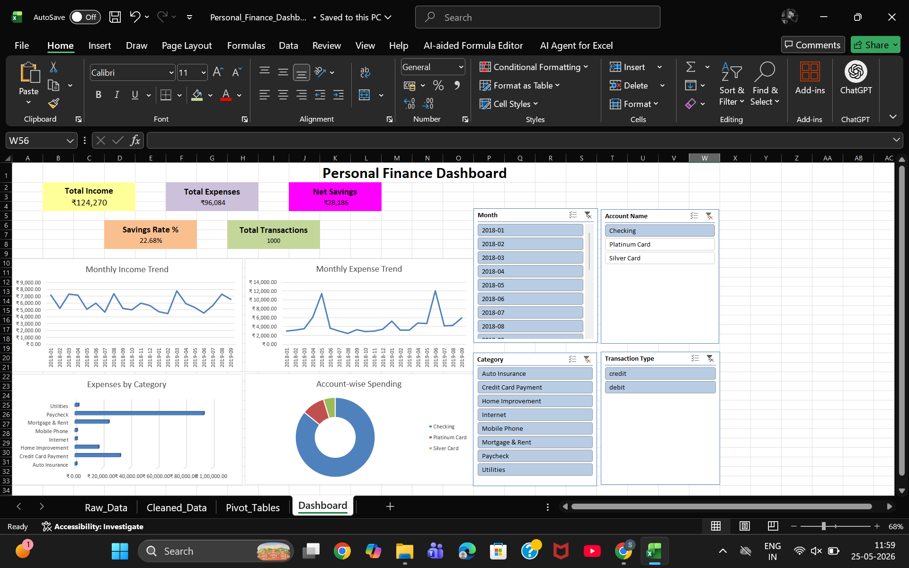

# Personal Finance Dashboard

## Project Overview
An interactive Personal Finance Dashboard built in Microsoft Excel.

## Features
- Total Income
- Total Expenses
- Net Savings
- Savings Rate %
- Total Transactions
- Monthly Income Trend
- Monthly Expense Trend
- Expenses by Category
- Account-wise Spending
- Interactive Slicers

## Tools Used
- Microsoft Excel
- Pivot Tables
- Pivot Charts
- KPI Cards
- Slicers

## Dashboard Preview

